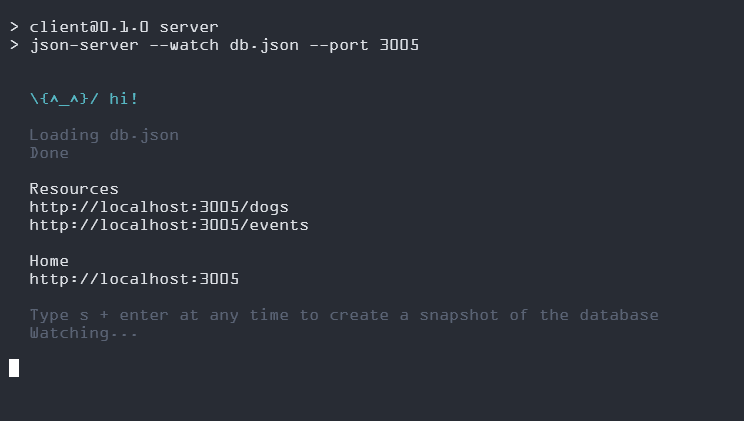
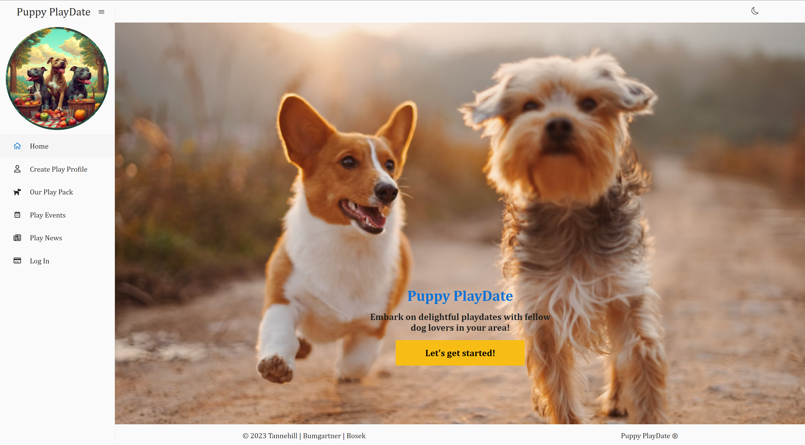

# Puppy PlayDate

Find furry companions for your pets and embark on delightful playdates with fellow dog lovers in your area!

This single-page application allows users to create a profile for their pooch and view other canine companions looking for socialization. Match with new friends, or unmatch if you don't feel it's a good fit. View and meet up at community events in your area!

## Home

- [Dependencies](#dependencies)
- [Starting the Application](#starting-the-application)
- [Using the Application](#using-the-application)
- [Optional Features](#optional-features)
- [License](#license)
- [Attributions](#attributions)
- [What I Learned](#what-i-learned)

## Intro To Project

- This project was made to complete the assignment `Phase 2 Project` for the `SE-West-091123` class for the [Flatiron](https://flatironschool.com/) Software Engineering Boot Camp.
- The project was completed using the following: `React`, `React Router`, `MUI`.

## Dependencies

- The following is needed to run this application: `Node`, `JSON Server`, `React`, `React Router`, `MUI`, `YUP`, `bcrypt`.

- You must have access to these dependencies in the directory that you are running this application in. If your environment does not have these requirements, you may install them in this order by going to these websites and following the installation instructions:

- [Npm - Node.JS](https://www.npmjs.com/package/node)

- [Npm - JSON Server](https://www.npmjs.com/package/json-server)

## Starting the Application

- Fork and clone this repo, and open in your favorite code editor.
- Run `npm install` or `npm i` to install necessary packages.
- Make sure nothing is currently running on `http://localhost:3005`.
- Open a terminal window in the main directory of where this project is located on your computer.
- Run `npm run server`.
- It should be running on `http://localhost:3005` and your terminal should look something like this:
- ==============================================
  
- ==============================================
- Open another terminal window in the main directory of where this project is located on your computer
- Run `npm run start`.
- It should take you to a page that looks like this:
- ==============================================
  
- ==============================================

## Using the Application

- On the Home page click `Let's Get Started!` button to create your pup's profile.
- Be sure to completely fill out the form, make a strong password, and `Submit`.
- You can view all of the other dogs in `Our Play Pack`, and search by name or keyword. Click `View` button for more details!
- On a pooch's profile, you can click the `Bone` button to match with them, or the `✖` button to unmatch.
- Matched dogs will now appear on `My Matches` page. You can unmatch at any time for a dog to no longer appear in the Play Pack.
- Logging in and out is easy with the button on the side navigation! Just don't forget your password!
- If you need to make changes to your profile, simply click the `Edit` button and you will be directed back to the initial form.
- Although we hope you won't, you can also delete your profile with the click of a button!

## Optional Features

- Toggle between light and dark mode with the icon in the top right corner of the screen. Your preferences will be saved in local storage.
- Application can be used with ease on any size screen! 
- It should look like this:
- ==============================================
  
- ==============================================

## License

- This project is is made in conjunction with the standard `MIT` license provided by `GitHub` upon creation of a new repository. A copy of the license is included with this project in a file named: `LICENSE`.

## Attributions

- The project was completed with collaboration from: `Kat Tannehill`, `Danner Baumgartner`, and `Anthony Bosek`
- This project was created with combination of skills learned from the `Flatiron` curriculum and our own individual research.
- Many of the photos used for the purposes of this project were supplied by [Unsplash](https://unsplash.com/).
- And of course, [Stack Overflow](https://stackoverflow.com/).

## What I Learned

- `Kat`: This project was an eye-opening experience in the world of React! It was an exciting challenge working with routing, context, and new-to-me packages like the snack bar. I enjoyed creating a fun, interactive application that I hope others can enjoy. My team was incredible, so knowledgeable and supportive, I can't express my appreciation for their efforts enough. I learned that where there is a will, there's a way, and probably a package to help you out too!
- `Danner`: Working on Puppy PlayDate with my team has been super fun and an amazing opportunity to learn React and get into responsive webpage building. The collaboration on this project opened us up to explore the world of team web development while gaining hands-on experience with React. It was a great chance to make something awesome with an awesome group of people. I really applaud my team's dedication and how we supported each other in tackling challenges. This project has solidified my belief that working together and learning as a team is a great way to experience code and community!
- `Anthony`: Building this app was great! It incorporated some of the fundamentals of `React` in a new and exciting way. We were able to incorporate client side routing with `React Router` and make this a true SPA. As always, I learned a great deal from the people I worked with on this project. With good communication and shared knowledge, we were able to overcome the conflicts efficiently and complete this project above our expectations. Awesome experience, stellar team!!

* [Back To Top](#home)
